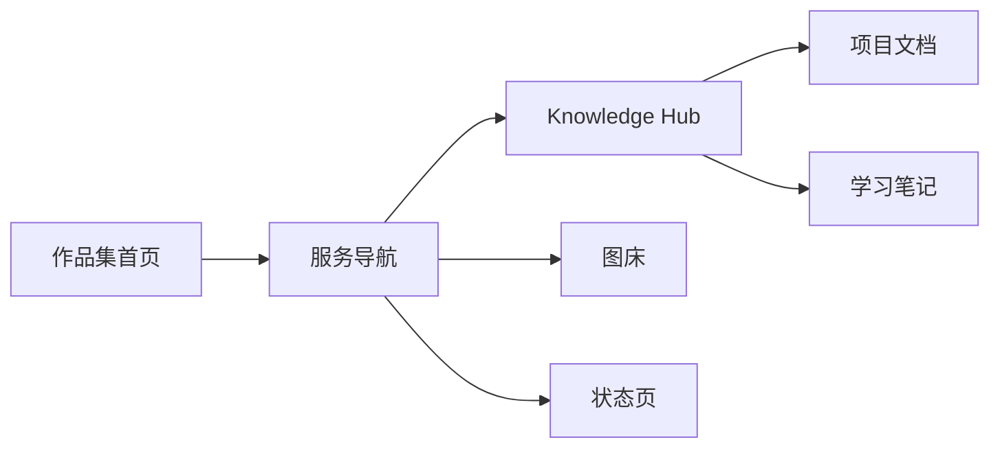

# 个人服务路线图

这份路线图记录 `hfdz1119.top` 个人数字空间的服务方向与当前状态。只记录公开用途和建设优先级，不记录密码、Token、真实后台路径或服务器地址。

## 当前重点

1. `nav.hfdz1119.top`：统一入口与服务状态面板，持续完善信息分组与链接。
2. `wiki.hfdz1119.top`：[[Knowledge Hub]]，优先补充部署记录、设计笔记与服务规划。
3. `status.hfdz1119.top`：服务器监控与可用性探针。
4. `drive.hfdz1119.top`：在监控稳定后建设个人网盘与跨设备资料访问。
5. `vault.hfdz1119.top`：最后推进；必须先具备 HTTPS、访问控制、备份与恢复演练。

## 服务清单

| 地址                  | 用途               | 状态     | 优先级   |
| --------------------- | ------------------ | -------- | -------- |
| `hfdz1119.top`        | 个人作品集首页     | 已上线   | 当前维护 |
| `nav.hfdz1119.top`    | 资源导航与状态入口 | 已上线   | 当前维护 |
| `image.hfdz1119.top`  | Cloudflare R2 图床 | 已上线   | 当前维护 |
| `wiki.hfdz1119.top`   | Knowledge Hub      | 建设中   | 当前重点 |
| `status.hfdz1119.top` | 服务器监控与探针   | 准备中   | 下一阶段 |
| `drive.hfdz1119.top`  | 网盘 / Alist       | 准备中   | 下一阶段 |
| `vault.hfdz1119.top`  | Bitwarden 密码库   | 受限规划 | 安全优先 |
| `bot.hfdz1119.top`    | Telegram Bot       | 规划中   | 第二阶段 |

## 公开与安全原则

- 导航站只展示已确认可公开的链接；未上线服务保留状态卡片，不建立可点击入口。
- `vault`、`panel` 等私人工具只展示 Cloudflare Access 保护入口，不公开真实管理路径、凭据、内网地址或访问策略细节。
- 每个新服务上线前，先补充部署记录、备份方式和基础故障排查说明。

